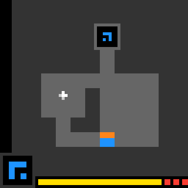

# Example run — arc-solve beats a level of LS20

A recorded run of this workflow against the live ARC-AGI-3 game **LS20**
(`ls20-9607627b`), inside an isolated TaskYou daemon.

```sh
ty pipeline -d arc-solve "solve ls20-9607627b"
```



*The agent's solution, replayed on the live game — the player token routes to the goal and `levels_completed` ticks to 1.*

## What the agent did

The agent set up the ARC SDK, explored the live game, and worked out the mechanics —
a player token that moves one cell per action, with a step-counter bar. It searched
for a route to the level's goal and found a **13-move solution**:

```json
{ "game": "ls20-9607627b",
  "actions": [3, 3, 3, 1, 1, 1, 1, 4, 4, 4, 1, 1, 1] }
```

In arrows (`1↑ 2↓ 3← 4→`): `← ← ←  ↑ ↑ ↑ ↑  → → →  ↑ ↑ ↑`.

Its own commit message: *"complete LS20 level 1 (rotate 270→0, reach goal)."*

## What the gate did

Completing the step ran the verify gate, which **reset the live game and replayed the
solution move by move**:

```
[ls20-9607627b] replayed 13 actions LIVE -> state=NOT_FINISHED,
                levels_completed=1/7 (need 1)
```

`levels_completed = 1` → the workflow was allowed to advance. The daemon log:

```
executor: Auto-completed finished workflow step after verify  id=1
```

Because the game is deterministic at seed 0, this replays identically every time — so
the pass means the moves *genuinely* complete a level, not that the agent said so. An
independent re-run confirmed the same result.

## Scope of this run

- Completed **level 1 of 7** — a level, not a full `WIN`. Raise the bar with
  `ARC_SOLVE_LEVELS`.
- The ARC SDK leaves the game's (obfuscated) source on disk; a determined agent can
  read it, so treat this as a **source-available** solve. The win itself is real and
  gate-verified against the live game either way.

> Note: the packaging (`ty plugins add` → the workflow resolving and running) is
> verified separately; this report documents the solve mechanism and its live-gate
> verification.
