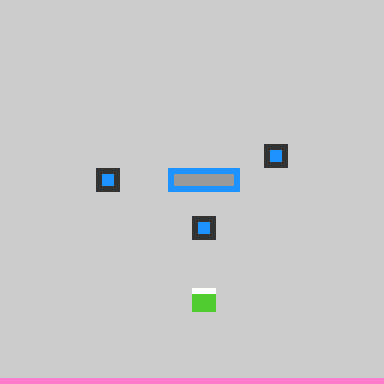

# Example run — arc-solve beats a level of WA30

A run of this workflow against the live ARC-AGI-3 game **WA30** (`wa30-ee6fef47`) —
a harder, sokoban-flavored game — driven end to end by the **arc-solve workflow** on a
real TaskYou instance.

```sh
ty pipeline -d arc-solve "solve wa30-ee6fef47"
```



## What the agent did

Running on **Opus 4.8 with high thinking effort**, the agent recognized WA30 as a
**carry-sokoban** puzzle — you shuttle pieces to targets — and ran a **BFS search**
over game states to find a route that completes a level. Its 26-move solution:

```json
{ "game": "wa30-ee6fef47",
  "actions": [1,1,3,1,1,1,3,3,5,4,4,4,5,1,4,4,5,2,3,3,5,2,5,1,1,5] }
```

Its commit: *"complete wa30-ee6fef47 level 1 via BFS carry-sokoban solver."*

## What the gate did

The solve step's verify gate reset the live game and **replayed the 26 moves**:

```
[wa30-ee6fef47] replayed 26 actions LIVE -> state=NOT_FINISHED,
                levels_completed=1/9 (need 1)
```

`levels_completed = 1` → the solve step completed and the workflow advanced to the
`report` step, which wrote `RESULT.md`. An independent replay confirmed the same
`1/9`.

## Why this run matters

Unlike a hand-driven demo, this was the **packaged plugin doing everything**: on a
fresh worktree the workflow installed the ARC SDK, copied its helper scripts out of
the installed plugin directory, played the live game, and gated completion on a real
level win — all from `ty plugins add` + `ty pipeline -d arc-solve`. And WA30 is a
step up in difficulty from [LS20](./example-run-ls20.md): not "walk to the goal" but
a search problem the agent had to model and solve.

## Scope

Completed **level 1 of 9**, not a full `WIN`. As with LS20, the ARC SDK leaves the
game's (obfuscated) source on disk, so this is a **source-available** solve — the win
itself is real and gate-verified against the live game.
